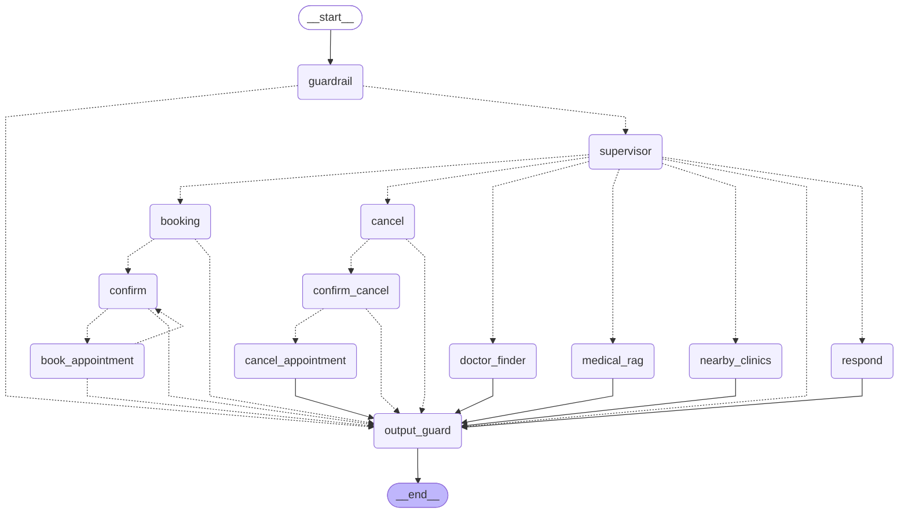

# Agent graph (generated)

Generated from the compiled LangGraph by `uv run python scripts/export_graph.py`; do not edit by hand. Dotted edges are conditional or `Command` routes.

```mermaid
---
config:
  flowchart:
    curve: linear
---
graph TD;
	__start__([<p>__start__</p>]):::first
	guardrail(guardrail)
	supervisor(supervisor)
	medical_rag(medical_rag)
	doctor_finder(doctor_finder)
	nearby_clinics(nearby_clinics)
	respond(respond)
	booking(booking)
	confirm(confirm)
	book_appointment(book_appointment)
	cancel(cancel)
	confirm_cancel(confirm_cancel)
	cancel_appointment(cancel_appointment)
	output_guard(output_guard)
	__end__([<p>__end__</p>]):::last
	__start__ --> guardrail;
	book_appointment -.-> confirm;
	book_appointment -.-> output_guard;
	booking -.-> confirm;
	booking -.-> output_guard;
	cancel -.-> confirm_cancel;
	cancel -.-> output_guard;
	cancel_appointment --> output_guard;
	confirm -.-> book_appointment;
	confirm -.-> output_guard;
	confirm_cancel -.-> cancel_appointment;
	confirm_cancel -.-> output_guard;
	doctor_finder --> output_guard;
	guardrail -.-> output_guard;
	guardrail -.-> supervisor;
	medical_rag --> output_guard;
	nearby_clinics --> output_guard;
	respond --> output_guard;
	supervisor -.-> booking;
	supervisor -.-> cancel;
	supervisor -.-> doctor_finder;
	supervisor -.-> medical_rag;
	supervisor -.-> nearby_clinics;
	supervisor -.-> output_guard;
	supervisor -.-> respond;
	output_guard --> __end__;
	classDef default fill:#f2f0ff,line-height:1.2
	classDef first fill-opacity:0
	classDef last fill:#bfb6fc
```
